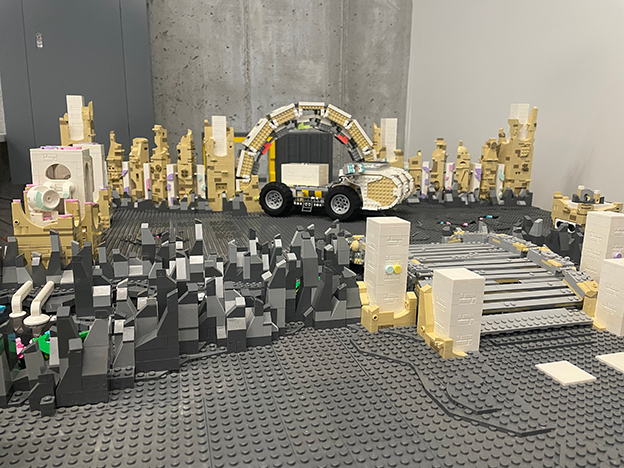
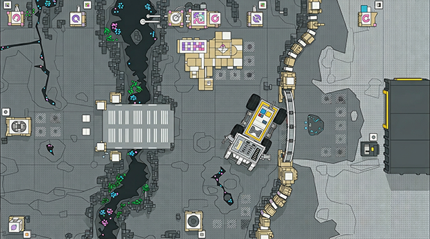
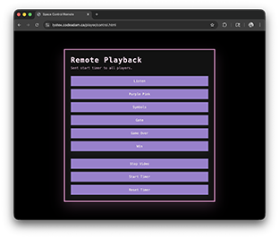
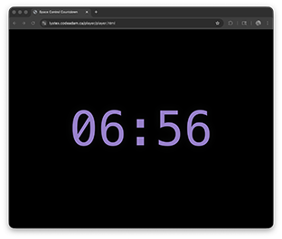
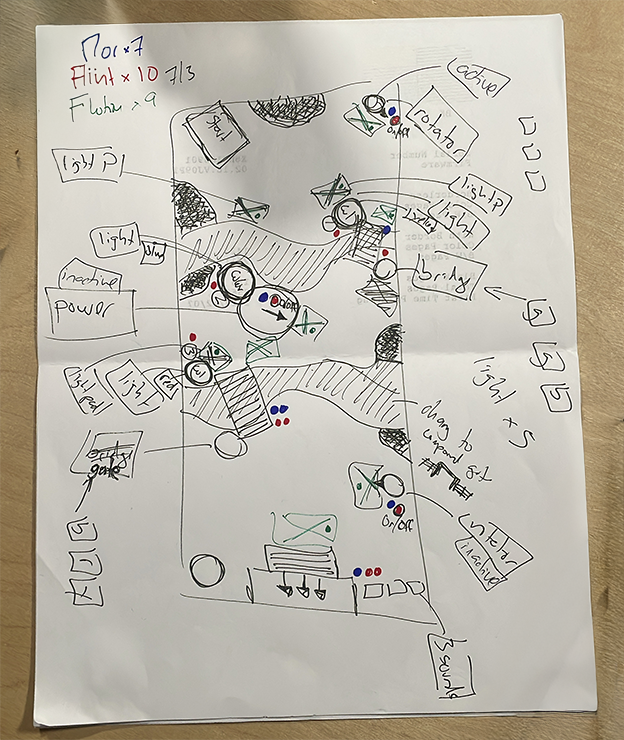

<!--

    <video style="position: absolute; top: 0; left: 0; width: 100%; height: 100%;" controls poster="images/poster.png">>
        <source src="videos/demo.mp4" type="video/mp4">
    </video>

> <small>Music by: https://www.bensound.com/fre    e-music-for-videos License code: 38VOT6UMWYZVD3FW Artist: : Yunior Arronte</small>

---
-->

## What is LYSTEX?

[LYSTEX](https://lystex.codeadam.ca) is a playable video game made entirely out of LEGO® bricks. Players use an Xbox controller to navigate a space rover through a series of puzzles to the bunker before the planet explodes.

### Game Stack

The playable game environment is built using LEGO® bricks. The interactive elements use LEGO® Spike™ and Pybricks (a custom firmware for the LEGO® Spike™).

The LYSTEX Player App ia a companion application delivering video hints to the player as checkpoitns are completed. This app is building using vanillia HTML and JavaScript, [Firebase](https://firebase.google.com/), and [GitHub Pages](https://pages.github.com/). 

 

1. Open both apps in separate browser windows
2. Click the player app to allow audio
3. In the control apop, click a video tpo play or modify the timer 

### Game Design

Original design drawing includes puzzles and location of key LEGO® components. 

> <small>LEGO® is a trademark of the LEGO Group of companies which does not sponsor, authorize or endorse this site.</small>

---

## Make Contact

Reach out to request a custom interactive LEGO® experience:

<form id="contactForm" action="#" method="post" style="max-width:800px;">
    <label for="name">Name:</label> 
    <input type="text" id="name" name="name">
     
    <label for="email">Email:</label> 
    <input type="email" id="email" name="email">
     
    <label for="message">Message:</label> 
    <textarea id="message" name="message" rows="5"></textarea>
     
    <button type="submit">Send</button>
</form>

--resources--

---

